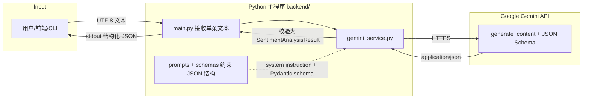

# 系统数据流向架构（第三周 / Week 3）

本图对应计划书中「后端：设计并绘制系统的数据流向架构图」交付物，描述 MVP 单条评论分析链路。

## 数据流（MVP 单条文本）

## 模块说明

| 模块 | 职责 |
|------|------|
| `main.py` | 入口：从命令行参数、文件或标准输入读取一条评论，打印 JSON。 |
| `config.py` | 读取 `GEMINI_API_KEY` / `GEMINI_MODEL`。 |
| `schemas.py` | 定义 `SentimentAnalysisResult`（情感、置信度、痛点、中文摘要）。 |
| `prompts.py` | 系统指令与用户提示，引导模型按 MVP 任务输出。 |
| `gemini_service.py` | 调用 `google-genai`，启用 `response_mime_type` + `response_json_schema`。 |

## 后续扩展（占位）

批量异步、RAG、向量库等将在后续周次在「检索 → 拼装上下文 → 大模型」节点上扩展，本图主干保持不变。
