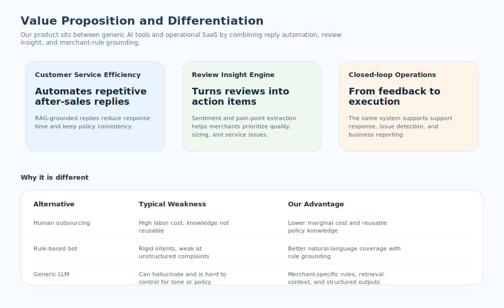
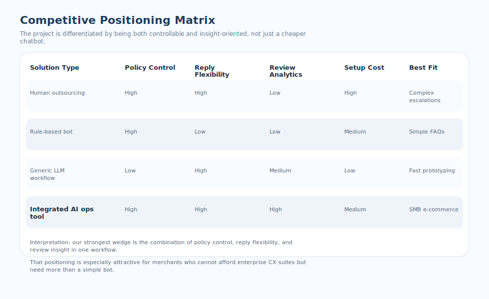
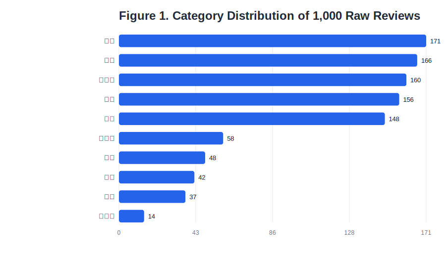
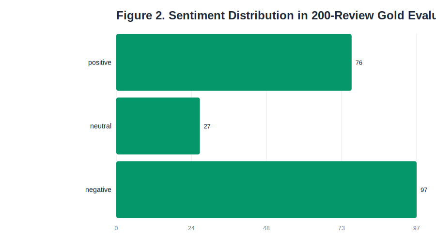
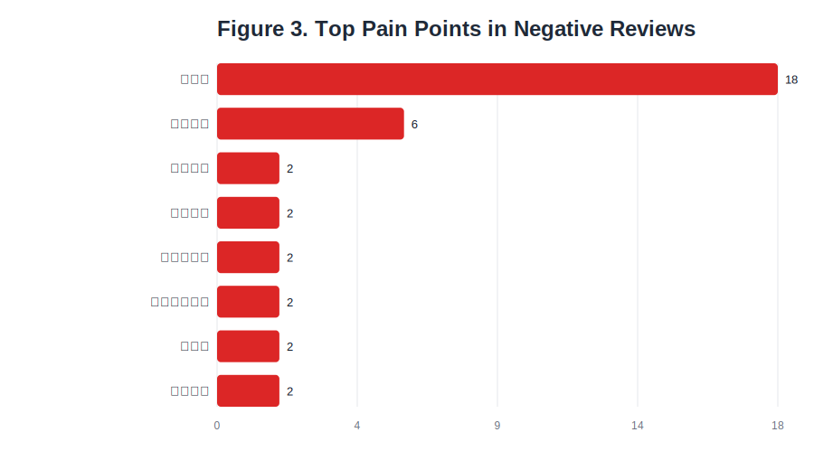
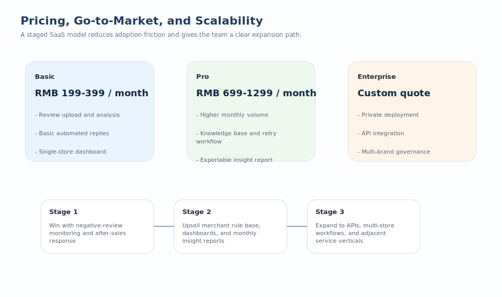

# 自动化客服与评论情感分析系统商业洞察报告

## 1. 创业想法与产品核心概念
本项目的创业想法是面向中小电商商家与本地生活服务商家，提供一套“自动化客服 + 评论情感分析 + 商业洞察输出”的智能运营工具，帮助商家在不显著增加人力成本的前提下，提高客服响应效率、沉淀可复用规则，并把原本分散的评论数据转化为可执行的经营决策。

产品核心由两条能力主线构成。第一条是基于 RAG 的智能客服，系统会先检索商家 FAQ、退换货规则和标准话术，再生成符合业务边界的回复。第二条是评论洞察引擎，系统对评论执行清洗、情感分类、痛点抽取和高频问题聚合，并用图表输出问题结构与变化趋势。两者共同形成从“用户反馈”到“经营动作”的闭环，使产品不只是一个会回复的机器人，而是一个能帮助商家发现问题、解释问题、推动改进的问题管理系统。

对商家的直接价值主要体现为三点。第一，降低重复售后咨询带来的人工压力。第二，把差评和低评分反馈转化为结构化运营线索。第三，让商家在不搭建复杂数据团队的情况下，也能形成周期性复盘材料和改进建议。这种“轻部署、强反馈、可行动”的产品形态，比单一客服工具更接近真实商业需求。

## 2. 价值主张与差异化定位
本项目的核心价值主张不是“替代全部人工客服”，而是成为商家的“客服效率层 + 评论洞察层 + 规则执行层”。它的目标客户不是大型企业联络中心，而是客服和运营都高度依赖少量人员、但日常要面对大量重复咨询与分散评论数据的中小电商团队。

从价值结构上看，产品的差异化主要来自三个维度。第一，客服回复不是纯生成，而是带有商家规则约束的检索增强回复，因此在退款、补发、售后流程等敏感场景下更可控。第二，评论分析不是只给正负标签，而是进一步抽取质量、尺寸、包装、服务态度等具体痛点，这让输出结果能直接对应到质检、商品页面、客服 SOP 等实际动作。第三，系统把前台客户沟通和后台经营分析打通，使“回复客户”和“复盘问题”发生在同一套工作流中。

如果拿现有替代方案做对比，人工客服外包的优点是灵活，但边际成本高且知识难沉淀；规则机器人可控但对自然语言和复杂抱怨适应性弱；通用大模型部署快，但缺少商家口径约束，容易输出不稳定甚至越权的回复。我们的产品切入的是三者之间的空白地带，即“可控性不牺牲灵活性，自动化不脱离业务规则，分析结果能直接转化为动作”的位置。

## 3. 目标市场与市场定位
本项目的首要目标市场是评论规模较大、售后咨询频繁、但客服和数据分析能力有限的中小电商商家，尤其适用于服饰、数码、食品生鲜、酒店和家居等高评论密度行业。典型客户画像包括：每天需要处理大量重复咨询、依赖平台评论判断产品质量、没有专门数据分析岗位、希望快速降低客服成本并提升店铺评分的商家或小型运营团队。

从市场进入顺序看，最适合优先切入的是“高评论密度 + 高频售后 + 对平台评分敏感”的商家群体。这类商家通常已经意识到评论与评分会直接影响转化，但尚未有预算采购完整的企业级客服平台，因此更容易接受“先解决一个关键问题、再逐步扩展使用场景”的轻量 SaaS 产品。

在定位上，产品不应与大型 CRM 或企业联络中心系统正面竞争，而应作为“低门槛、高 ROI、快速上线”的商家运营工具进入市场。对用户来说，它的采购逻辑更接近“能不能一周内用起来、能不能看出差评原因、能不能减少重复咨询”，而不是“是否具备全渠道联络中心的复杂治理能力”。

## 4. 市场环境分析

### 4.1 客户需求与市场驱动
当前市场存在三个清晰的需求驱动。第一，消费者越来越习惯数字化支持，但并不接受体验很差的自动化服务。Qualtrics 的 2024 Consumer Experience Trends Report 显示，58% 的消费者愿意与聊天机器人或 AI 自助支持交互，但他们同时更重视“有人味”的服务体验。第二，评论对购买决策的影响越来越强。BrightLocal 2024 调研显示，75% 的消费者会经常或总是阅读在线评论，88% 的消费者更愿意使用会回复所有评论的商家。第三，电商经营对履约体验极为敏感。DHL 2024 Online Purchasing Behavior Report 显示，95% 的全球网购消费者表示配送选项会影响他们在哪家店购买。

这些数据共同说明，商家今天面临的不是“要不要做自动化”，而是“如何把自动化做得既高效又不损害客户体验”。如果回复效率低、差评处理慢、评论无人分析，问题会直接反映到转化率、店铺评分和复购表现上。对中小商家而言，一个能够同时帮助他们“回应评论、吸收评论、解释评论”的产品具备明确价值。

### 4.2 竞争对手分析
当前可替代方案大致可以分为四类。第一类是人工客服或客服外包，优势在于灵活处理复杂情绪，但缺点是成本高、稳定性弱、知识难沉淀。第二类是规则机器人或平台原生机器人，优点是可控且便宜，但往往只能覆盖简单问答，难以处理自然语言差评和复杂售后表述。第三类是通用大模型工作流，优点是搭建快、创意强，但经常面临回复不稳定、难以严格遵守商家规则的问题。第四类是大型客户体验或联络中心平台，功能完整但实施成本、配置门槛和团队要求较高，不适合多数中小商家作为起步方案。

我们的竞争切口不是做“最全”的客服平台，而是做“最贴近中小商家经营动作”的智能运营工具。换句话说，项目的竞争优势在于它不试图把客服、数据仓库、BI、CRM 全部重做，而是聚焦于一个高价值窄切口：让评论与售后数据能够在低门槛条件下转化为实际动作。这种聚焦会让产品在初期更容易形成清晰卖点和可验证 ROI。

### 4.3 行业趋势分析
行业层面同样支持这个方向。Grand View Research 的 2025 报告显示，全球 AI for Customer Service 市场在 2024 年约为 130.1 亿美元，预计到 2033 年将增长至 838.5 亿美元，2025-2033 年复合增速约为 23.2%；其中 retail & e-commerce 被列为增长最快的 end-use 领域之一，预测 CAGR 为 26.0%。McKinsey 在 2024 年 customer care 调研中也指出，超过 80% 的受访企业已经在投资或即将投资生成式 AI，而数字化整合水平更高的组织更有可能实现超预期的客户服务表现。

对于我们的项目而言，这意味着两点。第一，AI 客服与体验运营已经不是单纯的概念赛道，而是明确增长的市场。第二，真正有机会被采纳的产品，不是泛化的“会聊天 AI”，而是能够嵌入客户服务流程、遵守规则、输出稳定结果的“运营型 AI 工具”。这与本项目的产品逻辑高度一致。

## 5. 数据与证据支撑
本项目目前已经有可验证的原型数据基础。首先，在评论分析方面，系统基于 200 条人工标注黄金测试集完成评估，整体准确率达到 92.5%，平均模型置信度为 0.878。这说明系统对主流评论情绪的识别已经具备较高实用性，虽然在“中性/负向边界”场景仍有优化空间，但已能够支撑商家进行批量监控和问题筛查。

其次，项目已整理 1000 条统一结构的原始评论数据，覆盖 10 个不同品类，包括平板、洗发水、水果、酒店、服饰、计算机等。这意味着系统并非只在单一行业验证，而是具备一定的跨品类泛化基础。对于课程项目或早期产品原型来说，这种多类目覆盖本身就是一个重要优势，因为它降低了“只在某个垂类偶然有效”的质疑。

再次，从负向评论抽取结果来看，系统已能够把“差评”进一步拆解成高频问题类型，而不是仅仅输出“负面”标签。例如在当前样本中，“质量差”出现 18 次，“尺寸不符”出现 6 次，其后还有“质量不符”“疑似假货”“客服态度差”等问题。相比传统情感分析只给出正负面标签，这种结构化痛点结果更接近商家实际需要，因为它直接对应质检、商品描述、客服培训、包装物流等不同运营动作。

### 5.1 关键数据摘要

| 指标 | 数值 | 说明 |
|------|------|------|
| 原始评论样本量 | 1,000 条 | 来自项目已整理的统一结构评论数据 |
| 覆盖品类数 | 10 个 | 包括平板、酒店、洗发水、水果、衣服等 |
| 黄金测试集规模 | 200 条 | 用于模型效果评估 |
| 情感分析整体准确率 | 92.5% | 185/200 条判断正确 |
| 模型平均置信度 | 0.878 | 反映整体结果较稳定 |
| 评估集中负向输出条数 | 97 条 | 适合做痛点挖掘与售后风险监控 |

### 5.2 图表 1：1,000 条原始评论品类分布

图 1 显示，当前评论数据主要集中在平板、酒店、洗发水、水果和衣服五类，前五大类目合计占据较高比例。这一分布说明系统原型验证并非建立在极端单一的样本结构之上，而是在多个典型消费场景中接受了测试。对于商业化来说，这意味着产品在进入市场时可以优先聚焦“高评论密度行业”，同时保留横向扩展空间。

### 5.3 图表 2：200 条黄金测试集上的情感输出分布

图 2 显示，在 200 条评估样本中，系统输出正向 76 条、中性 27 条、负向 97 条。结合 92.5% 的整体准确率，这意味着系统已经能够较稳定地覆盖商家最关心的负向评论发现任务，而不是只擅长识别“明显好评”。对于商家来说，负向样本捕捉能力越强，越能及时触发客服补救、退款安抚和产品迭代动作。

### 5.4 图表 3：负向评论中的高频痛点

图 3 反映了系统从负向评论中抽取出的高频问题。当前样本里，“质量差”出现 18 次，是最显著的核心缺陷；其次是“尺寸不符” 6 次，随后包括“质量不符”“疑似假货”“客服态度差”等问题。这类信息的商业意义在于：它不只是告诉商家“有差评”，而是直接指出差评的结构性来源，使商家能够把资源优先投入到最影响转化与复购的问题上。

## 6. 商业模式与增长策略

### 6.1 定价策略
从中小商家的采购逻辑出发，最合理的定价方式是 SaaS 订阅 + 用量分层。基础版应解决“先用起来”的门槛问题，因此价格带可以相对低，核心能力放在评论分析、基础自动回复和单店看板。专业版应强化高并发、知识库容量、失败重试、批量导出和月报能力，以支撑成长型店铺或代运营团队。企业版则以私有部署、接口集成、多品牌治理和数据合规为卖点，面向预算更高但需求更复杂的客户。

### 6.2 营销与市场进入策略
市场进入策略应采用“从单点高痛场景切入”的方式，而不是一开始试图覆盖所有电商需求。最现实的切入点是差评监控和售后回复，因为这两类场景价值明确、效果容易被感知，也最容易形成复购和口碑传播。具体做法可以是：先以评论分析看板和差评自动总结作为低门槛入口，再引导客户接入商家规则文档，进一步解锁智能客服能力，最后在积累足够数据后推出经营月报和产品改进建议，形成由“工具”向“经营助手”的升级路径。

在营销策略上，应以结果导向的案例展示为主，而不是技术概念宣传。对于中小商家来说，“用了 GPT/RAG/向量库”本身不构成购买理由；真正有说服力的是“客服响应更快了”“差评原因更清晰了”“复盘报告能指导补货和产品改进”。因此，早期营销更适合采用 demo 样例、行业模板、免费试用和定制化演示，而不是大规模品牌投放。此外，可以与代运营团队、跨境店铺服务商或电商培训机构合作，通过 B2B2C 模式放大获客效率。

### 6.3 可扩展性与增长路径
从可扩展性看，本产品具备较好的横向复制能力。因为核心流程是“导入评论 + 规则文本 -> 分析与检索 -> 输出回复与洞察”，这一能力不仅能用于电商，也能扩展到酒店、本地生活、教育咨询、医疗服务预约等高频文本交互行业。同时，技术上采用模块化结构后，未来可继续扩展多语言支持、平台接口对接、定时报表生成和自动化运营工作流，形成更强的产品粘性。

图中的商业化路径强调了一个原则：先让客户在一个明确场景中看到价值，再扩展到更高客单价能力。这样的路线既有利于降低初始销售阻力，也有利于团队在有限资源下形成清晰的产品节奏。

## 7. 结论
综合来看，本项目不是单纯的“AI 聊天工具”，而是一个以真实商家经营问题为出发点的智能运营系统。其核心商业价值在于：用规则增强的客服回复降低人工成本，用评论洞察提升问题发现与决策效率，并通过可视化与结构化输出把 AI 能力转化为商家愿意持续付费的经营价值。

基于当前原型在 200 条黄金测试集上达到 92.5% 的情感分析准确率、已覆盖 1000 条跨 10 个品类的评论数据，以及已经实现的检索增强客服回复链路，本项目具备从课程原型向真实商业试点进一步推进的可行性。下一阶段若能补充更多真实商家案例、量化节省工时与差评改善效果，其商业说服力将进一步增强。

## 8. 外部参考来源
1. Qualtrics, 2024 Consumer Experience Trends Report: [https://www.qualtrics.com/articles/news/qualtrics-announces-top-consumer-experience-trends-for-2024/](https://www.qualtrics.com/articles/news/qualtrics-announces-top-consumer-experience-trends-for-2024/)
2. BrightLocal, Local Consumer Review Survey 2024: [https://www.brightlocal.com/research/local-consumer-review-survey-2024/](https://www.brightlocal.com/research/local-consumer-review-survey-2024/)
3. DHL eCommerce, 2024 Online Purchasing Behavior Report: [https://www.dhl.com/global-en/microsites/ec/ecommerce-insights/ecommerce-insights-2024-survey/online-purchasing-report.html](https://www.dhl.com/global-en/microsites/ec/ecommerce-insights/ecommerce-insights-2024-survey/online-purchasing-report.html)
4. Grand View Research, AI for Customer Service Market Report: [https://www.grandviewresearch.com/industry-analysis/ai-customer-service-market-report](https://www.grandviewresearch.com/industry-analysis/ai-customer-service-market-report)
5. McKinsey, Where is customer care in 2024?: [https://www.mckinsey.com/capabilities/operations/our-insights/where-is-customer-care-in-2024](https://www.mckinsey.com/capabilities/operations/our-insights/where-is-customer-care-in-2024)
6. Pax8, 2024 Artificial Intelligence Buying Trends Report: [https://www.pax8.com/en-apac/news-post/pax8s-2024-artificial-intelligence-buying-trends-report-reveals-how-ai-will-transform-the-smb-landscape/](https://www.pax8.com/en-apac/news-post/pax8s-2024-artificial-intelligence-buying-trends-report-reveals-how-ai-will-transform-the-smb-landscape/)
